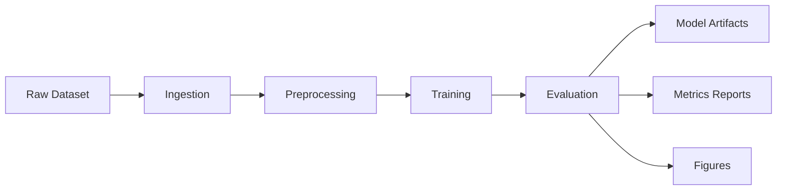

# Interpretable ML Churn Prediction Pipeline

This is a reproducible machine learning pipeline for predicting customer churn using the Telco Customer Churn dataset.

The objective of this project is not to only train a model, but to demonstrate a production-style ML pipeline design with deterministic preprocessing, reproducible, and traceable artifacts.

---

## Overview

This project implements a modular ML pipeline that does the following:

- Loads the raw churn data with provenance metadata
- Applies deterministic preprocessing
- Trains interpretable and non-linear models
- Selects a decision threshold using a validation set
- Evaluates the final performance on a held-out test set
- Saves the reproducible artifacts (models, metrics, and figures)

---

## Design Philosophy / Research Motivation

The design of this pipeline is influenced by my MSc dissertation research on Stepwise Simplex Projection Decomposition (SSPD), a deterministic dimensional reduction framework that is implemented as a multi-stage pipeline.

SSPD performs dimensional reduction through a sequence of explicit transformation steps rather than a single optimisation step. Each stage produces intermediate outputs and diagnostic metrics that allow the behaviour of the transformation process to be inspected and evaluated.

This project adopts similar principles in the context of machine learning pipelines:

- Deterministic transformations
- Explicit stage boundaries
- Traceable intermediate artifacts
- Measurable evaluation between stages

The pipeline architecture reflects the same emphasis on reproducibility, traceability, and controlled transformations.

---

## Engineering Goals

This project focuses on demonstrating several ML engineering practices:

- Reproducible pipelines
- Deterministic preprocessing and model evaluation
- Clear separation of pipeline stages
- Artifact persistence for experiment inspection
- Leakage-safe evaluation protocols

The emphasis is on the reliability and traceability of the pipeline itself, and not only the model performance.

## Pipeline Architecture

### Stage Responsibilities

**Ingestion**

- Loads the raw dataset
- Then adds the provenance metadata:
    - __source_file
    - __ingested_at_utc

**Preprocessing**

- Dataset cleaning and schema validation
- Enforcing feature/target contracts
- Deterministic train/val/test split
- Construction of an unfitted ColumnTransformer 

**Training**

- Builds the sklearn pipelines that combine preprocessing and modeling
- Fits the models on the training split only

**Evaluation**

- Selects the best decision threshold on the validation set
- Computes the final metrics on the test set
- Generates the experiment artifacts

---

## Dataset

The project uses the Telco Churn dataset, which is a common benchmark dataset for churn prediction.

Dataset source: [Telco Customer Churn Dataset](https://www.kaggle.com/datasets/blastchar/telco-customer-churn)

Target variable: 
    Churn

Classes:
    Yes → customer churned
    No → customer retained

Typical features include:
- Customer tenure
- Monthly charges
- Contract type
- Payment method
- Internet services
- Demographics

Class imbalance is moderate at approximately 26% churn

---

## Reproducibility Principles

The pipeline design is based on the objective of reproducibility

### Key Principles

**Deterministic configuration**
    All experiments settings are controlled through src/config.py
    Examples:
    - random seed
    - split ratios
    - evaluation thresholds
    - model selection flags

**No data leakage**
    The data splits follow the ML evaluation protocol:
        train → model fitting
        validation → threshold selection
        test → final evaluation
    The preprocessing pipeline is fit on the training data through the sklearn pipeline.

**Traceability of the Artifacts**
    All pipeline runs generate artifacts:
        outputs/
            models/
            metrics/
            figures/
    The metrics artifacts consist of:
        - A snapshot of the model configuration
        - Threshold sweep results
        - Confusion matrix
        - Evaluation metrics
        - Sizes of the dataset splits
    This allows the experiments to be reproducible and to be inspected without running the pipeline again.

---

## How to Run the Pipeline

1. Create the environment

    conda env create -f environment.yml
    conda activate churn-interp

2. Run the pipeline

    python run_pipeline.py

The pipeline will:

1. Load the dataset
2. Run the preprocessing
3. Train the models
4. Evaluate the results
5. Save the artifacts

---

## Results

Two models are currently evaluated:

    - Logistic Regression (interpretable baseline)
    - Random Forest (non-linear comparison)

    An example of results from a pipeline run:

        ROC-AUC:
            Logistic Regression: 0.822
            Random Forest: 0.802

        PR-AUC:
            Logistic Regression: 0.580
            Random Forest: 0.573

        F1:
            Logistic Regression: 0.603
            Random Forest: 0.580

        Threshold:
            Logistic Regression: 0.65
            Random Forest: 0.35

The thresholds are selected using validation F1 maximisation.
The final metrics are computed on the test set once.
Full results are stored in:
    outputs/metrics/

---

## Artifacts Produced

Each pipeline run generates the following artifacts.

### Model artifacts

Serialised sklearn pipelines:

    outputs/models/
        logreg.joblib
        random_forest.joblib

### Evaluation metrics

The experiment results and the configuration snapshot:

    log_reg_metrics.json
    random_forest_metrics.json

The metrics include:

- ROC-AUC
- PR-AUC
- Accuracy
- Precision
- Recall
- F1
- Confusion matrix
- Validation threshold sweep

### Figures

The visualisation of the confusion matrix:

    outputs/figures/
        logreg_confusion_matrix.png
        random_forest_confusion_matrix.png

---

## Project Structure

project_root/ 
│ 
├── run_pipeline.py 
├── environment.yml 
├── README.md 
│ 
├── src/ 
│   ├── ingestion.py 
│   ├── preprocessing.py 
│   ├── modeling.py 
│   ├── evaluate.py 
│   ├── config.py 
│   └── paths.py 
│ 
├── data/ 
│   └── raw/ 
│ 
└── outputs/ 
    ├── models/ 
    ├── metrics/ 
    └── figures/
    

---

## Future Work

There are possible extensions for this project:

- Feature importance analysis
- Calibration analysis
- Additional versioning
- Experimental versioning
- Larger dataset pipelines (e.g. NYC Taxi)

---

## Author

Charlie Maguire
MSc Data Science (Merit)
LinkedIn: https://www.linkedin.com/in/charlie-maguire-08b5871b8/